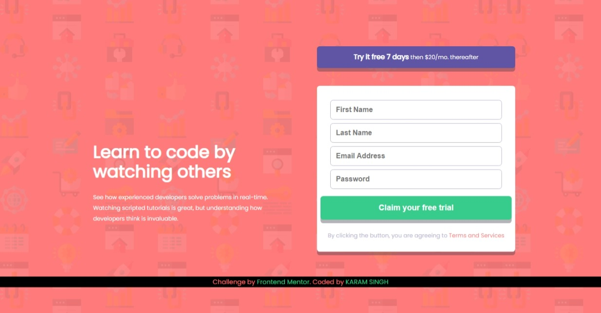

# Frontend Mentor - Intro component with sign up form solution

This is a solution to the [Intro component with sign up form challenge on Frontend Mentor](https://www.frontendmentor.io/challenges/intro-component-with-signup-form-5cf91bd49edda32581d28fd1). Frontend Mentor challenges help you improve your coding skills by building realistic projects.

## Table of contents

- [Overview](#overview)
  - [The challenge](#the-challenge)
  - [Screenshot](#screenshot)
  - [Links](#links)
- [My process](#my-process)
  - [Built with](#built-with)
  - [Continued development](#continued-development)
- [Author](#author)

## Overview

### The challenge

Users should be able to:

- View the optimal layout depending on their device's screen size
- See hover and focus states for interactive elements

### Screenshot

### Links

- Solution URL:(https://github.com/karam-7/intro-component)
- Live Site URL:(https://karam-7.github.io/intro-component/)

## My process

### Built with

- Semantic HTML5 markup
- CSS custom properties
- grid

### Continued development

Learn more about responsive Design and much more to learn

## Author

- Website - [KARAM SINGH](http://karam-portfolio.liveblog365.com)
- Frontend Mentor - [@karam-7](https://www.frontendmentor.io/profile/karam-7)
- LinkedIn - [@Karam Singh](https://www.linkedin.com/in/karam-singh-a77818b6/)

